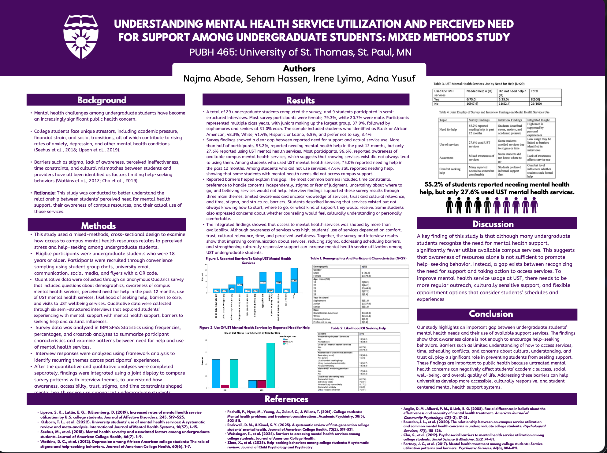

# Irene Lyimo’s Public Health Portfolio

Welcome to my public health portfolio. This repository highlights selected academic and research projects related to health equity, mental health, global health, and access to care.

## Featured Project

### Understanding Mental Health Service Utilization and Perceived Need for Support Among Undergraduate Students

This collaborative mixed-methods study examined the relationship between undergraduate students’ perceived need for mental health support, awareness of campus resources, and actual use of university mental health services.

**Institution:** University of St. Thomas  
**Course:** PUBH 465  
**Project type:** Collaborative mixed-methods research study

#### Methods

- Anonymous cross-sectional survey administered through Qualtrics
- Quantitative analysis using IBM SPSS Statistics
- Semi-structured qualitative interviews
- Framework analysis to identify recurring themes
- Integration of quantitative and qualitative findings through a joint display
- Development of a scientific research poster

#### Key Findings

- 55.2% of surveyed students reported needing mental health support during the previous 12 months.
- Only 27.6% reported using University of St. Thomas mental health services.
- Important barriers included time constraints, stigma, uncertainty about accessing services, limited knowledge of available options, and concerns about cultural relevance and trust.
- The findings suggest that awareness of services alone may not be sufficient to encourage help-seeking.

#### Public Health Significance

The study demonstrates an important gap between recognizing a need for mental health support and accessing available services. Improving communication, reducing stigma, offering flexible appointments, and strengthening culturally responsive support may increase service utilization among undergraduate students.

#### Skills Demonstrated

- Mixed-methods research
- Survey development and administration
- Quantitative and qualitative analysis
- Research interviewing
- Joint display development
- Data visualization
- Scientific writing and poster design
- Collaborative research

## Additional Projects

### Healthcare Workforce Shortages

A project examining the causes and public health consequences of healthcare workforce shortages. A detailed project summary will be added as materials are organized.

### HPV Vaccination and HIV Care Integration

Upcoming research related to integrating HPV vaccination into ART clinics serving girls living with HIV in Zambia. Only appropriate materials approved for public sharing will be added.

## Research Integrity

This portfolio contains only appropriate, de-identified, and non-confidential materials. No participant-level data or protected information is publicly shared.
